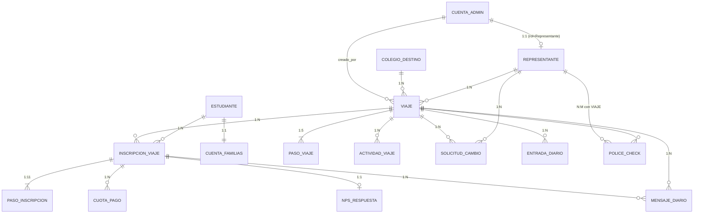

# 03 — Modelo de Datos (objetivo)

> **Fuente de verdad:** PRD *Modelo de Base de Datos y Matriz de Roles y Permisos* **v1.7** (Agente 4 — el documento original está fechado mayo 2026; incorporado al repo en junio 2026). El doc raw vive en [`fuentes/modelo-datos-v1.7.md`](./fuentes/modelo-datos-v1.7.md).
>
> Este documento es la spec **objetivo** del modelo: lo que el portal debe terminar implementando. La última sección ("Delta vs. implementación actual") compara contra los schemas Drizzle vigentes en `src/lib/db/schema/`.

**Novedades de v1.7:** `COLEGIO_DESTINO.tipo_entrada_requerida` ENUM(ETA|VISA|Ninguna) + regla RV-C1 · bullet C1 en inicialización de pasos · nota de arquitectura "Representante del sistema vs. GL físico" en `VIAJE.id_representante`.

---

## Índice

1. [Resumen y principios de diseño](#1-resumen-y-principios-de-diseño)
2. [Diagrama entidad-relación](#2-diagrama-entidad-relación)
3. [Entidades](#3-entidades)
4. [Relaciones y cardinalidades](#4-relaciones-y-cardinalidades)
5. [Reglas de validación críticas (RV)](#5-reglas-de-validación-críticas-rv)
6. [Matriz de roles y permisos](#6-matriz-de-roles-y-permisos)
7. [Multi-tenancy (v2)](#7-multi-tenancy-v2)
8. [Glosario](#8-glosario)
9. [Delta vs. implementación actual](#9-delta-vs-implementación-actual)

---

## 1. Resumen y principios de diseño

El modelo cubre las tres capas de la plataforma JUK:

- **Portal de Gestión Interno** — back-office del equipo JUK, con vista diferenciada para Representantes.
- **Vista del Representante** — acceso acotado al portal interno para group leaders externos.
- **Portal de Familias** — portal separado de autoservicio para padres/tutores (DNI como usuario).

Decisiones de negocio clave que el modelo respeta:

- Dos tipos de cuenta separados: `CUENTA_ADMIN` (portal interno) y `CUENTA_FAMILIAS` (portal familias).
- Flujo de pago determinado por el tipo de representante: "Vía agencia" para Independiente, Instituto y Colegio cliente; "Directo JUK" exclusivo del tipo `JUK_Directo`.
- 11 pasos de inscripción por alumno por viaje (Paso 0 + grupos A–D), con pasos condicionales según flags del viaje, configuración del colegio destino y edad del alumno.
- NPS con tres dimensiones (JUK, Representante, Colegio UK) por alumno por viaje; los puntajes de viaje y representante son agregados computados, no almacenados.

> ⚠️ AMBIGUO: el Resumen Ejecutivo del PRD habla de "10 pasos de inscripción" y §4.7 dice que al crear una inscripción "se generan los 10 registros de PASO_INSCRIPCION", pero §4.8 y la tabla de relaciones (§5, cardinalidad "1:11") definen **11** filas: Paso 0 + A1, A2, A3, B1, B2, C1, C2, C3, D1, D2. Las menciones de "10" son texto desactualizado de versiones previas; la definición vigente es **11 pasos por inscripción**.

**Principios de diseño (PRD §2):**

1. Separación de contextos de autenticación: `CUENTA_ADMIN` y `CUENTA_FAMILIAS` son entidades distintas con ciclos de vida y portales propios.
2. Normalización de pasos de seguimiento: `PASO_INSCRIPCION` y `PASO_VIAJE` son tablas de detalle, no columnas en `VIAJE`/`ESTUDIANTE`.
3. Multi-viaje por alumno: `INSCRIPCION_VIAJE` es la junction que permite múltiples inscripciones activas de un mismo alumno.
4. Datos sensibles marcados: los campos de facturación del `ESTUDIANTE` existen en el modelo, pero la capa de negocio bloquea su exposición al Representante.
5. Flags de condicionalidad centralizados en `VIAJE`: `paso9_aplica` y `paso10_aplica` se calculan al crear/editar el viaje.
6. NPS como entidad propia: `NPS_RESPUESTA` es 1:1 con `INSCRIPCION_VIAJE`; los puntajes de viaje/representante son vistas computadas.
7. Trazabilidad completa: `LOG_AUDITORIA` captura toda acción; cada tabla de estado incluye `actualizado_por` y `fecha_actualizacion`.

---

## 2. Diagrama entidad-relación

`LOG_AUDITORIA` queda fuera del diagrama: referencia cualquier cuenta y cualquier entidad de forma genérica.

---

## 3. Entidades

### 3.1 CUENTA_ADMIN

Portal de acceso único para el equipo JUK (rol Admin) y Representantes externos (rol Representante). Comparten formulario de login y expiración de sesión (**8 horas**). Un mismo registro **no** puede tener simultáneamente ambos roles.

| Campo | Tipo | Oblig. | Notas |
|---|---|---|---|
| `id_cuenta_admin` | UUID (PK) | NOT NULL | Generado automáticamente |
| `email` | VARCHAR(255) | NOT NULL | UNIQUE — actúa como username |
| `nombre` | VARCHAR(100) | NOT NULL | |
| `apellido` | VARCHAR(100) | NOT NULL | |
| `password_hash` | VARCHAR(255) | NOT NULL | Hash bcrypt |
| `rol` | ENUM | NOT NULL | `Admin` \| `Representante` \| `SuperAdmin`. Admin: equipo operador (en v1 siempre JUK), acceso completo según `sub_rol_admin`. Representante: entidad externa, vista acotada. SuperAdmin: reservado v2 (multi-tenant); en v1 no se asigna; si se asigna equivale a Admin con permisos de gestión de cuentas; no genera lógica nueva en v1 |
| `sub_rol_admin` | ENUM | NULL | `CEO` \| `Sales` \| `Marketing` \| `Operations` — solo si rol = Admin o SuperAdmin |
| `es_super_admin` | BOOLEAN | Default FALSE | Puede gestionar cuentas de otros usuarios |
| `activo` | BOOLEAN | Default TRUE | Cuenta habilitada para acceso |
| `fecha_creacion` | TIMESTAMP | NOT NULL | |
| `fecha_ultimo_acceso` | TIMESTAMP | NULL | Último login exitoso |
| `intentos_fallidos` | INT | Default 0 | Resetea al login exitoso |
| `bloqueado_hasta` | TIMESTAMP | NULL | Bloqueo temporal: 5 intentos fallidos → 15 min |
| `reset_token` | VARCHAR(255) | NULL | Caduca a las 24 hs |
| `reset_token_expira` | TIMESTAMP | NULL | |

### 3.2 CUENTA_FAMILIAS

Cuenta del Portal de Familias. Se genera **automáticamente** al crear el alumno (RV-12); el envío de credenciales es una acción manual separada del equipo JUK. El DNI del alumno es el username.

> ✅ RESUELTO (**MIN-07**, decisión 11/06/2026): el Interno (US-19b) decía usuario = email del Tutor 1; este Modelo y Familias, DNI del alumno. Decisión: la identidad de auth es el **email del Tutor 1** (Better-Auth); el DNI del alumno queda como **selector/búsqueda**. Permite N alumnos por grupo familiar con una sola cuenta.

| Campo | Tipo | Oblig. | Notas |
|---|---|---|---|
| `id_cuenta_familias` | UUID (PK) | NOT NULL | |
| `id_estudiante` | UUID (FK → ESTUDIANTE) | NOT NULL | UNIQUE — 1:1 con ESTUDIANTE |
| `dni_alumno` | VARCHAR(20) | NOT NULL | Username; copia desnormalizada de `ESTUDIANTE.dni` |
| `password_hash` | VARCHAR(255) | NOT NULL | Hash bcrypt de la contraseña temporal asignada por JUK |
| `activo` | BOOLEAN | Default FALSE | Pasa a TRUE al enviar credenciales |
| `primer_acceso` | BOOLEAN | Default TRUE | Fuerza cambio de contraseña en el primer ingreso |
| `fecha_creacion` | TIMESTAMP | NOT NULL | Automático, al dar de alta el alumno |
| `fecha_envio_credenciales` | TIMESTAMP | NULL | Cuándo JUK envió las credenciales |
| `email_contacto` | VARCHAR(255) | NOT NULL | Email del padre/tutor principal (o del alumno si `Alumno_Adulto`) |
| `whatsapp` | VARCHAR(30) | NULL | Para alertas urgentes |
| `titular` | ENUM | NOT NULL | `Padre_Tutor` \| `Alumno_Adulto`. Determinado automáticamente: `Alumno_Adulto` si el alumno cumple 18 antes de `VIAJE.fecha_inicio`. Determina lenguaje del portal, visibilidad de A3/D1 (ex Pasos 5/8) y destinatario del NPS |

### 3.3 COLEGIO_DESTINO

Institución educativa en el extranjero (principalmente UK) donde estudian los alumnos. Gestiona formularios propios (Application Form, Parental Consent) y requisitos específicos. **No confundir** con el Colegio cliente argentino, que en el modelo objetivo es un atributo de `REPRESENTANTE` (tipo = `Colegio_cliente`).

| Campo | Tipo | Oblig. | Notas |
|---|---|---|---|
| `id_colegio_destino` | UUID (PK) | NOT NULL | |
| `nombre` | VARCHAR(200) | NOT NULL | Nombre oficial |
| `pais` | VARCHAR(50) | NOT NULL | UK, Irlanda, EE.UU., etc. |
| `ciudad` | VARCHAR(100) | NOT NULL | |
| `direccion` | VARCHAR(300) | NULL | |
| `coordenadas_lat` | DECIMAL(9,6) | NULL | Para mapa interactivo |
| `coordenadas_lon` | DECIMAL(9,6) | NULL | |
| `sitio_web` | VARCHAR(255) | NULL | |
| `contacto_academico_nombre` | VARCHAR(200) | NOT NULL | Contacto Académico / Principal |
| `contacto_academico_email` | VARCHAR(255) | NOT NULL | |
| `contacto_academico_telefono` | VARCHAR(50) | NOT NULL | |
| `contacto_admin_nombre` | VARCHAR(200) | NOT NULL | Contacto Administrativo / Documentos |
| `contacto_admin_email` | VARCHAR(255) | NOT NULL | |
| `contacto_admin_telefono` | VARCHAR(50) | NOT NULL | |
| `contacto_alojamiento_nombre` | VARCHAR(200) | NULL | Contacto Alojamientos |
| `contacto_alojamiento_email` | VARCHAR(255) | NULL | |
| `contacto_alojamiento_telefono` | VARCHAR(50) | NULL | |
| `contacto_juniors_nombre` | VARCHAR(200) | NULL | Contacto Programa / Juniors |
| `contacto_juniors_email` | VARCHAR(255) | NULL | |
| `contacto_juniors_telefono` | VARCHAR(50) | NULL | |
| `url_application_form` | VARCHAR(500) | NULL | PDF del Application Form del colegio |
| `fecha_actualizacion_app_form` | DATE | NULL | |
| `url_parental_consent_menor16` | VARCHAR(500) | NULL | Versión < 16 años |
| `url_parental_consent_16_17` | VARCHAR(500) | NULL | Versión 16–17 años |
| `fecha_actualizacion_parental_consent` | DATE | NULL | Alerta si > 12 meses |
| `config_application_form` | ENUM | NOT NULL | `Requerido` \| `Opcional` \| `NA` — Default `Requerido`. Hoy todos los colegios lo requieren. Determina inicialización del Paso A1 (Pendiente o NA) |
| `config_test_nivel` | ENUM | NOT NULL | `Requerido` \| `Opcional` \| `NA` — Default `NA`. Solo Wimbledon School of English en Requerido. Determina inicialización del Paso A2 |
| `config_parental_consent` | ENUM | NOT NULL | `Requerido` \| `Opcional` \| `NA` — Default `NA`. Solo Wimbledon en Requerido. Aun en Requerido, A3 es NA automático si el alumno tiene ≥ 18 años (RV-23). Determina inicialización del Paso A3 |
| `config_confirmation_letter` | ENUM | NOT NULL | `Requerido` \| `Opcional` \| `NA` — Default `Requerido` |
| `config_visa_immigration` | ENUM | NOT NULL | `Requerido` \| `Opcional` \| `NA` — Default `Requerido`. Afecta la inicialización del Paso C2 (Immigration Letter). Independiente de `tipo_entrada_requerida` |
| `tipo_entrada_requerida` | ENUM | NOT NULL | `ETA` \| `VISA` \| `Ninguna` — Default `ETA`. Documentación de entrada al país para argentinos. Inicializa el Paso C1: ETA → Pendiente (UK); VISA → NA (visa fuera del scope de v1; USA/Canadá); Ninguna → NA (Irlanda para argentinos). Ver RV-C1 |
| `url_confirmation_letter` | VARCHAR(500) | NULL | Template/instructivo general del colegio (no el individual por alumno, que va en `PASO_INSCRIPCION`) |
| `url_visa_immigration_template` | VARCHAR(500) | NULL | Instrucciones generales para visado o ETA. Distinto de la Immigration Letter individual (paso C2) |
| `estado` | ENUM | NOT NULL | `Activo` \| `Inactivo` \| `En_negociacion` |
| `notas_internas` | TEXT | NULL | Solo visible para Admin JUK |
| `fecha_creacion` | TIMESTAMP | NOT NULL | |
| `id_organizacion` | UUID | NULL | En v1 siempre NULL (JUK). Reservado multi-tenant v2 (§7) |

> **Nota de implementación (Interno v1.13, US-05b):** la nota de arquitectura del Interno exige modelar la configuración de documentos como **entidad independiente** (`colegio_documento_config`, una fila por documento), NO como columnas fijas. La implementación va a seguir al Interno; las columnas `config_*` de esta tabla quedan como referencia de los 5 documentos a configurar.

> ✅ RESUELTO (**MIN-11**, decisión 11/06/2026): el Interno decía default "Opcional" para todos los documentos; valen los **defaults por documento de este Modelo v1.7** — App Form Requerido, Test de Nivel NA, Parental Consent NA, Confirmation Letter Requerido, Visa/Immigration Requerido.

> **Nota (TEC-11.k):** el estado `En_negociacion` no existe en el Interno v1.13, que solo define `Activo|Inactivo` para el colegio. Decidir al implementar.

### 3.4 REPRESENTANTE

Group leader externo asignado a uno o más viajes. El **tipo** determina el flujo de pago del viaje y la aplicabilidad de los Pasos 9 (D2) y 10 (B2).

| Campo | Tipo | Oblig. | Notas |
|---|---|---|---|
| `id_representante` | UUID (PK) | NOT NULL | |
| `id_cuenta_admin` | UUID (FK → CUENTA_ADMIN) | NULL | UNIQUE donde NOT NULL; rol = Representante. NULL para tipo = `JUK_Directo` (singleton sin acceso al portal) |
| `nombre` | VARCHAR(100) | NOT NULL | |
| `apellido` | VARCHAR(100) | NOT NULL | |
| `email` | VARCHAR(255) | NOT NULL | Email de contacto (= username) |
| `telefono` | VARCHAR(50) | NULL | |
| `tipo` | ENUM | NOT NULL | `Independiente` \| `Instituto` \| `Colegio_cliente` \| `JUK_Directo`. JUK_Directo: singleton preexistente, sin cuenta de portal, flujo siempre Directo_JUK, fee = 0 |
| `nombre_institucion` | VARCHAR(200) | NULL | Requerido si tipo ≠ Independiente |
| `cuil_cuit` | VARCHAR(20) | NULL | Identificación fiscal |
| `razon_social` | VARCHAR(200) | NULL | |
| `condicion_fiscal` | VARCHAR(50) | NULL | Monotributista, RI, etc. |
| `requiere_psicofisico` | BOOLEAN | Default FALSE | **⚠️ DEPRECATED desde v1.3** — la condición del Paso 9 la determina `VIAJE.tipo_viaje`, no este campo. Conservado por compatibilidad histórica; no usar en lógica nueva. Ver RV-07 |
| `fee_representante_pct` | DECIMAL(5,2) | NULL | % de fee del representante (flujo Vía agencia); solo aplica si tipo ≠ Colegio_cliente |
| `activo` | BOOLEAN | Default TRUE | |
| `fecha_creacion` | TIMESTAMP | NOT NULL | |
| `notas_internas` | TEXT | NULL | Solo Admin JUK |
| `id_organizacion` | UUID | NULL | En v1 siempre NULL. Reservado multi-tenant v2 (§7) |

### 3.5 VIAJE

Salida organizada por JUK: un colegio destino, un representante principal y un conjunto de alumnos. El estado controla qué acciones son posibles; `flujo_pago`, `paso9_aplica` y `paso10_aplica` determinan el comportamiento de los pasos de inscripción de todos los alumnos del viaje.

| Campo | Tipo | Oblig. | Notas |
|---|---|---|---|
| `id_viaje` | UUID (PK) | NOT NULL | |
| `nombre` | VARCHAR(200) | NOT NULL | Nombre o código (ej: "UK-ENE-2027") |
| `tipo_viaje` | ENUM | NOT NULL | `Grupal` \| `Individual` — Default `Grupal`. Individual = un alumno viajando sin grupo. Determina capacidad, estado inicial y lógica de pasos |
| `id_colegio_destino` | UUID (FK → COLEGIO_DESTINO) | NOT NULL | |
| `id_representante` | UUID (FK → REPRESENTANTE) | NOT NULL | Representante **del sistema** (contacto responsable con acceso al portal). Nota de arquitectura v2: los GL que físicamente acompañan al grupo pueden ser otras personas; en v1 ambos roles siempre coinciden. Múltiples GL físicos independientes se resuelve en v2 |
| `fecha_inicio` | DATE | NOT NULL | Fecha de partida |
| `fecha_fin` | DATE | NOT NULL | Fecha de regreso |
| `num_group_leaders` | INT | NOT NULL | Mínimo 1 para Grupales. Individuales = 0 (el alumno viaja sin GL asignado por JUK) |
| `capacidad_maxima` | INT | NOT NULL | Grupal: `num_group_leaders × 12`. Individual: fijo = 1 |
| `estado` | ENUM | NOT NULL | `Inscripcion_abierta` \| `Confirmado` \| `En_curso` \| `Finalizado` \| `Cancelado`. Grupales inician en Inscripcion_abierta; Individuales se crean directamente en Confirmado (RV-04 no aplica) |
| `flujo_pago` | ENUM | NOT NULL | `Via_agencia` \| `Directo_JUK` — derivado de `REPRESENTANTE.tipo`: Independiente/Instituto → Via_agencia; Colegio_cliente → Via_agencia; JUK_Directo → Directo_JUK. **No editable manualmente**; se recalcula al crear el viaje y al reasignar representante. Ver RV-05 |
| `paso10_aplica` | BOOLEAN | NOT NULL | TRUE si tipo = Independiente o Instituto. FALSE si Colegio_cliente (paga vía agencia sin excepción presencial) o JUK_Directo. Calculado al crear el viaje |
| `paso9_aplica` | BOOLEAN | NOT NULL | TRUE si `tipo_viaje = Grupal` (Paso D2 aplica); FALSE si Individual (D2 = NA). Calculado al crear el viaje. Ver RV-07 |
| `comision_agencia_pct` | DECIMAL(5,2) | NULL | % de comisión de la agencia externa (ej: 6.0); solo si `flujo_pago = Via_agencia` |
| `notas_internas` | TEXT | NULL | Solo Admin JUK |
| `fecha_creacion` | TIMESTAMP | NOT NULL | |
| `creado_por` | UUID (FK → CUENTA_ADMIN) | NOT NULL | Admin JUK que creó el viaje |
| `id_organizacion` | UUID | NULL | En v1 siempre NULL. Reservado multi-tenant v2 (§7) |

### 3.6 ESTUDIANTE

Alumno participante. El alta se inicia vía Application Form JUK (Google Form con webhook) o manualmente. Al crear el registro se genera automáticamente la `CUENTA_FAMILIAS` (RV-12). Un alumno puede inscribirse en múltiples viajes.

| Campo | Tipo | Oblig. | Notas |
|---|---|---|---|
| `id_estudiante` | UUID (PK) | NOT NULL | |
| `nombre` | VARCHAR(100) | NOT NULL | |
| `apellido` | VARCHAR(100) | NOT NULL | |
| `fecha_nacimiento` | DATE | NOT NULL | Determina versión del Parental Consent |
| `dni` | VARCHAR(20) | NOT NULL | **UNIQUE** — username en Portal Familias |
| `numero_pasaporte` | VARCHAR(50) | NOT NULL | |
| `pais_pasaporte` | VARCHAR(50) | NOT NULL | País emisor |
| `fecha_vencimiento_pasaporte` | DATE | NOT NULL | Validado contra `fecha_fin` del viaje (RV-01/02/17) |
| `email_alumno` | VARCHAR(255) | NULL | |
| `nombre_tutor_1` | VARCHAR(200) | NOT NULL | Tutor/padre principal |
| `email_tutor_1` | VARCHAR(255) | NOT NULL | |
| `telefono_tutor_1` | VARCHAR(50) | NOT NULL | |
| `nombre_tutor_2` | VARCHAR(200) | NULL | |
| `email_tutor_2` | VARCHAR(255) | NULL | |
| `telefono_tutor_2` | VARCHAR(50) | NULL | |
| `cuil_cuit` | VARCHAR(20) | NULL | **SENSIBLE** — solo Admin JUK (RV-20) |
| `razon_social` | VARCHAR(200) | NULL | **SENSIBLE** — solo Admin JUK (RV-20) |
| `condicion_fiscal` | VARCHAR(50) | NULL | **SENSIBLE** — solo Admin JUK (RV-20) |
| `alergias_alimentarias` | TEXT | NULL | |
| `alergias_ambientales` | TEXT | NULL | |
| `alergias_medicamentos` | TEXT | NULL | |
| `condiciones_cronicas` | TEXT | NULL | Condiciones de salud crónicas relevantes |
| `medicacion_habitual` | TEXT | NULL | Nombre, dosis y frecuencia |
| `observaciones_salud` | TEXT | NULL | Incluye EpiPen, etc. |
| `observaciones_internas` | TEXT | NULL | SOLO Admin JUK |
| `estado` | ENUM | NOT NULL | `Pre-inscripto` \| `Activo` \| `Baja` \| `Pausado` — Default `Pre-inscripto`. Ciclo: Google Form → webhook → Pre-inscripto (notificación interna) → Admin asigna a viaje → Activo → Baja o Pausado |
| `origen_alta` | ENUM | NOT NULL | `Google_Form` \| `Manual` |
| `fecha_alta` | TIMESTAMP | NOT NULL | |

> **Nota (TEC-11.e):** el Interno v1.13 define **6 estados** para el alumno: `Pre-inscripto|Inscripto|Activo|Viajando|Finalizado|Baja`. Valen los 6 (queda por decidir si `Pausado` — que solo aparece en este Modelo — se suma).

### 3.7 INSCRIPCION_VIAJE

Junction N:M entre `ESTUDIANTE` y `VIAJE`; cada fila es la participación de un alumno en un viaje. Al crearla se generan automáticamente los 11 registros de `PASO_INSCRIPCION` y las N `CUOTA_PAGO` del plan definido para ese viaje.

| Campo | Tipo | Oblig. | Notas |
|---|---|---|---|
| `id_inscripcion` | UUID (PK) | NOT NULL | |
| `id_estudiante` | UUID (FK → ESTUDIANTE) | NOT NULL | |
| `id_viaje` | UUID (FK → VIAJE) | NOT NULL | |
| `fecha_inscripcion` | TIMESTAMP | NOT NULL | Cuándo se asignó el alumno al viaje |
| `estado` | ENUM | NOT NULL | `Activo` \| `Baja` — Default `Activo` |
| `motivo_baja` | TEXT | NULL | |
| `fecha_baja` | TIMESTAMP | NULL | |
| `accommodation_direccion` | VARCHAR(500) | NULL | Dirección de la casa de familia (cargada con la Accommodation Letter); activa el pin en el mapa |
| `accommodation_familia` | VARCHAR(200) | NULL | Nombre de la familia anfitriona |
| `accommodation_coordenadas_lat` | DECIMAL(9,6) | NULL | |
| `accommodation_coordenadas_lon` | DECIMAL(9,6) | NULL | |
| `url_certificado` | VARCHAR(500) | NULL | PDF del certificado del curso (Módulo 8 Portal Familias); NULL hasta que JUK lo carga post-viaje |
| `fecha_carga_certificado` | TIMESTAMP | NULL | |

**Constraints:** `UNIQUE(id_estudiante, id_viaje)` — un alumno no puede estar dos veces en el mismo viaje (RV-16; la reinscripción reactiva el mismo registro).

### 3.8 PASO_INSCRIPCION

Estado de cada uno de los **11 pasos** (Paso 0 + grupos A–D) que cada alumno acumula por viaje. Al crear la inscripción se generan las 11 filas: el Paso 0 siempre inicia en Completado (auto-creado e inmutable); el resto según las reglas del viaje, la config del colegio destino y la edad del alumno. Los pasos de cada grupo son **paralelos** entre sí, excepto C2 que inicia Bloqueado hasta que B1 esté Completado (RV-C2).

| Campo | Tipo | Oblig. | Notas |
|---|---|---|---|
| `id_paso` | UUID (PK) | NOT NULL | |
| `id_inscripcion` | UUID (FK → INSCRIPCION_VIAJE) | NOT NULL | |
| `codigo_paso` | VARCHAR(3) | NOT NULL | `0`=App Form JUK · `A1`=App Form colegio · `A2`=Test de Nivel · `A3`=Parental Consent · `B1`=Plan de cuotas · `B2`=Último pago presencial · `C1`=ETA · `C2`=Immigration Letter · `C3`=Accommodation Letter · `D1`=Autorización viaje (escribano) · `D2`=Certificado psicofísico |
| `grupo` | VARCHAR(1) | NOT NULL | `0` · `A`=Inscripción y programa · `B`=Pagos · `C`=Documentación de viaje · `D`=Documentación legal argentina. Para filtrar/agrupar en el tablero |
| `estado` | ENUM | NOT NULL | `Pendiente` \| `En_progreso` \| `Completado` \| `Bloqueado` \| `NA` — Default `Pendiente`. Paso 0 siempre Completado; C2 inicia Bloqueado |
| `fecha_limite` | DATE | NULL | |
| `fecha_completado` | TIMESTAMP | NULL | |
| `motivo_bloqueo` | TEXT | NULL | Ej: C2 esperando B1 Completado; ETA rechazado |
| `url_documento` | VARCHAR(500) | NULL | Documento asociado cargado en el sistema |
| `notas_internas` | TEXT | NULL | NO visibles para el Representante |
| `actualizado_por` | UUID (FK → CUENTA_ADMIN) | NULL | |
| `fecha_actualizacion` | TIMESTAMP | NOT NULL | Se actualiza en cada cambio |

**Constraints:** `UNIQUE(id_inscripcion, codigo_paso)`.

> **Nota (TEC-11.d):** al ENUM de `estado` le falta **`Vencido`**, que el Interno v1.13 define para A1 (fecha límite pasada sin completar). Agregarlo al implementar.

**Reglas de inicialización automática:**

- **Paso 0** (App Form JUK): se crea al dar de alta el alumno; estado siempre `Completado`, inmutable (RV-00).
- **A2** (Test de Nivel): `NA` si `COLEGIO_DESTINO.config_test_nivel = NA`.
- **A3** (Parental Consent): `NA` si `config_parental_consent = NA` **o** si el alumno tiene ≥ 18 años al inicio del viaje (RV-23). Condiciones independientes: cualquiera de las dos genera NA.
- **B2** (Último pago presencial): `NA` si `VIAJE.paso10_aplica = FALSE` (Colegio_cliente o JUK_Directo). Ver RV-05 y RV-06.
- **C1** (ETA): `Pendiente` si `tipo_entrada_requerida = ETA`; `NA` si `VISA` o `Ninguna` (RV-C1).
- **C2** (Immigration Letter): inicia en `Bloqueado`; solo se activa cuando el B1 de la misma inscripción está `Completado` (RV-C2).
- **D1** (Autorización escribano): `NA` si el alumno tiene ≥ 18 años al inicio del viaje (RV-23).
- **D2** (Certificado psicofísico): `NA` si `VIAJE.tipo_viaje = Individual` (RV-07).

### 3.9 CUOTA_PAGO

Cada cuota del plan de pagos de un alumno por viaje. Los pagos **no son online**: JUK los registra manualmente a partir de la información de la agencia externa (Vía agencia) o directamente (Directo JUK). El Paso 10 (B2) es una **vista especializada del último CUOTA_PAGO**, no un registro separado (RV-08).

| Campo | Tipo | Oblig. | Notas |
|---|---|---|---|
| `id_cuota` | UUID (PK) | NOT NULL | |
| `id_inscripcion` | UUID (FK → INSCRIPCION_VIAJE) | NOT NULL | |
| `numero_cuota` | INT | NOT NULL | 1, 2, 3… secuencial por inscripción |
| `monto_usd` | DECIMAL(10,2) | NOT NULL | Monto en USD |
| `fecha_vencimiento` | DATE | NOT NULL | |
| `fecha_pago` | DATE | NULL | Cuándo se registró el pago |
| `estado` | ENUM | NOT NULL | `Pendiente` \| `Pagado` \| `Vencido` \| `NA` — Default `Pendiente` |
| `es_ultimo_pago` | BOOLEAN | Default FALSE | Última cuota, vinculada al Paso 10; solo una por inscripción (RV-22) |
| `registrado_por` | UUID (FK → CUENTA_ADMIN) | NULL | |
| `notas` | TEXT | NULL | |
| `fecha_actualizacion` | TIMESTAMP | NOT NULL | |

**Constraints:** `UNIQUE(id_inscripcion, numero_cuota)` · partial unique index `UNIQUE(id_inscripcion) WHERE es_ultimo_pago = TRUE` (PostgreSQL; en MySQL/MariaDB: trigger o CHECK compuesto — RV-22).

> ✅ RESUELTO (**CRIT-05**, decisión 11/06/2026 — ⭐ validar con Felix): el PRD fijaba las cuotas en **USD** (`monto_usd`) y la convención del proyecto usaba **GBP**. Decisión: **multi-moneda** — campo `moneda` ENUM (`USD|GBP|ARS`) + monto + cotización opcional, **default USD**.

> **Nota (TEC-11.h):** a esta tabla le falta el campo **`canal`** (`'Vía agencia'` \| `'Presencial JUK'`) que B1/B2 del Interno v1.13 requieren por cuota. Agregarlo al implementar.

### 3.10 NPS_RESPUESTA

Encuesta de satisfacción post-viaje completada por el padre/tutor desde el Portal de Familias. Tres dimensiones independientes: JUK, Representante y Colegio UK. Se habilita cuando el Admin JUK marca el viaje `Finalizado` (RV-15).

> **Lectura compatible (RV-15 + Familias v1.11, US-9.1):** la fila de `NPS_RESPUESTA` se **crea** cuando el viaje pasa a `Finalizado` (RV-15), y la encuesta se **habilita para la familia a los 3 días del regreso** (US-9.1 del PRD de Familias). No es una contradicción: creación del registro y habilitación de la encuesta son dos momentos distintos.

| Campo | Tipo | Oblig. | Notas |
|---|---|---|---|
| `id_nps` | UUID (PK) | NOT NULL | |
| `id_inscripcion` | UUID (FK → INSCRIPCION_VIAJE) | NOT NULL | UNIQUE — 1:1 con la inscripción |
| `score_juk` | INT | NULL | 0–10; NULL hasta que el padre responde |
| `score_representante` | INT | NULL | 0–10; NULL hasta que responde |
| `score_colegio` | INT | NULL | 0–10; NULL hasta que responde |
| `comentario_juk` | TEXT | NULL | |
| `comentario_representante` | TEXT | NULL | |
| `comentario_colegio` | TEXT | NULL | |
| `fecha_habilitacion` | TIMESTAMP | NOT NULL | Al marcar el viaje Finalizado |
| `fecha_respuesta` | TIMESTAMP | NULL | NULL si aún no respondió. Una vez seteada, el registro es **inmutable** (RV-21) |

**Vistas computadas (no campos almacenados):**

- **NPS del viaje** = promedio de `score_juk`, `score_representante` y `score_colegio` de todos los alumnos del viaje.
- **NPS del representante** = promedio acumulado de `score_representante` de todos sus viajes.
- Ambas son solo lectura en el Portal Interno; la fuente es siempre el Portal de Familias.

### 3.11 PASO_VIAJE

Los **5 trámites** coordinados a nivel de viaje (no por alumno), responsabilidad de JUK y/o el Representante. Se generan automáticamente al crear el viaje. En Individuales: Paso 5 (Police checks) inicia `NA` (no hay GL); Paso 1 (Pasajes) aplica con semántica distinta — JUK registra el vuelo autogestionado por el alumno (RV-24).

| Campo | Tipo | Oblig. | Notas |
|---|---|---|---|
| `id_paso_viaje` | UUID (PK) | NOT NULL | |
| `id_viaje` | UUID (FK → VIAJE) | NOT NULL | |
| `numero_paso` | INT | NOT NULL | 1=Pasajes · 2=Excursiones · 3=Transfers · 4=Tarjeta transporte · 5=Police checks (rango 1–5) |
| `estado` | ENUM | NOT NULL | `Pendiente` \| `En_progreso` \| `Completado` \| `Bloqueado` \| `NA` — Default `Pendiente` |
| `fecha_completado` | TIMESTAMP | NULL | |
| `notas` | TEXT | NULL | Observaciones internas |
| `actualizado_por` | UUID (FK → CUENTA_ADMIN) | NULL | |
| `fecha_actualizacion` | TIMESTAMP | NOT NULL | |

**Constraints:** `UNIQUE(id_viaje, numero_paso)`.

> ⚠️ AMBIGUO: RV-10 dice que el Paso 3 (Transfers) no puede inicializarse hasta que el Paso 1 (Pasajes) esté "al menos en **Confirmado**", pero `Confirmado` no es un valor del ENUM de estado de PASO_VIAJE (`Pendiente|En_progreso|Completado|Bloqueado|NA`). Probablemente quiera decir `Completado` (o un sub-estado de Pasajes no modelado). A confirmar antes de implementar la dependencia.

### 3.12 ACTIVIDAD_VIAJE

Excursiones y actividades del programa. Pueden ser **fijas** (estándar, siempre incluidas) o **variables** (opcionales, sujetas a confirmación). El Representante puede proponer variables, pero JUK debe aprobarlas. Las aprobadas se reflejan automáticamente en el calendario visible por el Representante.

> ✅ RESUELTO (**CRIT-04**, decisión 11/06/2026 — ⭐ validar con equipo): el Interno v1.13 (US-38) decía que el representante aprueba/rechaza las actividades variables; este Modelo, que solo propone y JUK aprueba. Decisión: el **representante aprueba/rechaza desde su vista**; las solicitudes de cambio quedan como mecanismo adicional para proponer modificaciones.

| Campo | Tipo | Oblig. | Notas |
|---|---|---|---|
| `id_actividad` | UUID (PK) | NOT NULL | |
| `id_viaje` | UUID (FK → VIAJE) | NOT NULL | |
| `nombre` | VARCHAR(200) | NOT NULL | |
| `descripcion` | TEXT | NULL | |
| `tipo` | ENUM | NOT NULL | `Fija` \| `Variable` |
| `fecha_actividad` | DATE | NOT NULL | |
| `hora_inicio` | TIME | NULL | |
| `duracion_minutos` | INT | NULL | |
| `lugar` | VARCHAR(200) | NULL | |
| `es_obligatoria` | BOOLEAN | Default FALSE | |
| `costo_adicional_usd` | DECIMAL(10,2) | NULL | Por alumno, si aplica |
| `estado_aprobacion` | ENUM | Default `Por_definir` | `Por_definir` \| `Propuesta` \| `Aprobada` \| `Rechazada` |
| `motivo_rechazo` | TEXT | NULL | Si JUK la rechazó |
| `propuesta_por` | UUID (FK → CUENTA_ADMIN) | NULL | Admin JUK o Representante |
| `fecha_creacion` | TIMESTAMP | NOT NULL | |

### 3.13 SOLICITUD_CAMBIO

Solicitud del Representante para modificar el calendario o proponer una actividad especial. JUK aprueba o rechaza. El Representante **no puede editar el calendario directamente** bajo ninguna circunstancia.

| Campo | Tipo | Oblig. | Notas |
|---|---|---|---|
| `id_solicitud` | UUID (PK) | NOT NULL | |
| `id_viaje` | UUID (FK → VIAJE) | NOT NULL | |
| `id_representante` | UUID (FK → REPRESENTANTE) | NOT NULL | |
| `tipo` | ENUM | NOT NULL | `Cambio_horario` \| `Actividad_nueva` \| `Cancelacion` \| `Otro` |
| `descripcion` | TEXT | NOT NULL | |
| `fechas_afectadas` | TEXT | NULL | JSON array de fechas |
| `urgencia` | ENUM | NOT NULL | `Urgente` \| `Normal` — Default `Normal` |
| `estado` | ENUM | NOT NULL | `Enviada` \| `En_revision` \| `Aprobada` \| `Rechazada` — Default `Enviada` |
| `motivo_rechazo` | TEXT | NULL | |
| `fecha_envio` | TIMESTAMP | NOT NULL | |
| `fecha_resolucion` | TIMESTAMP | NULL | |
| `resuelto_por` | UUID (FK → CUENTA_ADMIN) | NULL | |

### 3.14 POLICE_CHECK

Control policial de los group leaders por viaje (el colegio destino lo requiere). Se gestiona **a nivel de viaje por representante**: un mismo representante necesita un police check vigente por cada viaje en el que participa.

| Campo | Tipo | Oblig. | Notas |
|---|---|---|---|
| `id_police_check` | UUID (PK) | NOT NULL | |
| `id_representante` | UUID (FK → REPRESENTANTE) | NOT NULL | |
| `id_viaje` | UUID (FK → VIAJE) | NOT NULL | |
| `estado` | ENUM | NOT NULL | `Pendiente` \| `Aprobado` \| `Vencido` \| `Rechazado` — Default `Pendiente` |
| `fecha_emision` | DATE | NULL | |
| `fecha_vencimiento` | DATE | NULL | Alerta si < 30 días de vigencia |
| `notas` | TEXT | NULL | |

**Constraints:** `UNIQUE(id_representante, id_viaje)`.

> **Nota (TEC-11.f):** el Interno v1.13 (US-41) exige el police check por **cada GL físico** del viaje, no por representante del sistema. Manda el Interno (la implementación actual ya lo modela por GL).

> **Nota (TEC-11.g):** los ENUM de estado difieren entre fuentes e implementación. Implementar la **unión**: `pendiente|en_tramite|aprobado|rechazado|vencido`.

### 3.15 LOG_AUDITORIA

Registro **inmutable** de todas las acciones del sistema (accesos, creaciones, modificaciones, borrados lógicos) para los tres tipos de cuenta. Solo lectura para todos los usuarios; solo el sistema escribe.

| Campo | Tipo | Oblig. | Notas |
|---|---|---|---|
| `id_log` | BIGINT (PK) | NOT NULL | Autoincremental — **no UUID**, por eficiencia de lectura |
| `id_cuenta` | UUID | NOT NULL | Cuenta que realizó la acción |
| `tipo_cuenta` | ENUM | NOT NULL | `Admin` \| `Representante` \| `Familias` |
| `accion` | VARCHAR(100) | NOT NULL | Código de acción (ej: LOGIN, UPDATE_PASO, SEND_CREDENCIALES) |
| `entidad` | VARCHAR(50) | NOT NULL | Entidad afectada |
| `id_entidad` | UUID | NULL | Registro afectado |
| `ip_address` | VARCHAR(50) | NULL | |
| `detalles` | JSONB / TEXT | NULL | Valores antes/después |
| `fecha_hora` | TIMESTAMP | NOT NULL | UTC; **índice en esta columna** |

### 3.16 ENTRADA_DIARIO

Contenido publicado por el Representante (o Admin JUK) durante el viaje para el Módulo 7 (Diario de Viaje) del Portal de Familias: novedad de texto o galería de fotos/videos. Solo los padres del mismo viaje ven las entradas publicadas.

| Campo | Tipo | Oblig. | Notas |
|---|---|---|---|
| `id_entrada` | UUID (PK) | NOT NULL | |
| `id_viaje` | UUID (FK → VIAJE) | NOT NULL | |
| `fecha` | DATE | NOT NULL | Día al que corresponde la entrada |
| `titulo` | VARCHAR(200) | NULL | |
| `contenido` | TEXT | NULL | Texto de la novedad |
| `urls_media` | TEXT | NULL | JSON array de URLs de fotos/videos en storage externo (fuera del scope del modelo) |
| `tipo` | ENUM | NOT NULL | `Novedad` \| `Foto_video` |
| `publicado` | BOOLEAN | Default FALSE | TRUE cuando es visible para los padres; publicación explícita |
| `subido_por` | UUID (FK → CUENTA_ADMIN) | NOT NULL | Representante o Admin JUK |
| `fecha_creacion` | TIMESTAMP | NOT NULL | |

### 3.17 MENSAJE_DIARIO

Canal de mensajes **asíncrono** entre el padre/tutor de un alumno específico y el Representante del viaje (Módulo 10 — Soporte — del Portal de Familias). No es chat en tiempo real: cada mensaje es un registro independiente, en el contexto de una inscripción.

| Campo | Tipo | Oblig. | Notas |
|---|---|---|---|
| `id_mensaje` | UUID (PK) | NOT NULL | |
| `id_viaje` | UUID (FK → VIAJE) | NOT NULL | Hilo de mensajes del viaje |
| `id_inscripcion` | UUID (FK → INSCRIPCION_VIAJE) | NOT NULL | Garantiza que el padre solo ve mensajes de su alumno |
| `remitente_tipo` | ENUM | NOT NULL | `Padre` \| `Representante` |
| `remitente_id` | UUID | NOT NULL | `id_cuenta_familias` si Padre; `id_cuenta_admin` si Representante (el tipo determina la tabla) |
| `contenido` | TEXT | NOT NULL | |
| `leido` | BOOLEAN | Default FALSE | TRUE cuando el destinatario lo vio |
| `fecha_envio` | TIMESTAMP | NOT NULL | |

---

## 4. Relaciones y cardinalidades

| Origen | Destino | Cardinalidad / regla |
|---|---|---|
| CUENTA_ADMIN | REPRESENTANTE | 1:1 — una cuenta con rol=Representante ↔ exactamente un representante. FK: `REPRESENTANTE.id_cuenta_admin` |
| COLEGIO_DESTINO | VIAJE | 1:N — FK: `VIAJE.id_colegio_destino` |
| REPRESENTANTE | VIAJE | 1:N — un representante lidera múltiples viajes; un viaje tiene exactamente uno. FK: `VIAJE.id_representante` |
| VIAJE | INSCRIPCION_VIAJE | 1:N — una inscripción por alumno. FK: `INSCRIPCION_VIAJE.id_viaje` |
| ESTUDIANTE | INSCRIPCION_VIAJE | 1:N — múltiples inscripciones en distintos viajes. FK: `INSCRIPCION_VIAJE.id_estudiante` |
| ESTUDIANTE | CUENTA_FAMILIAS | 1:1 — la cuenta se crea automáticamente con el alumno. FK: `CUENTA_FAMILIAS.id_estudiante` (UNIQUE) |
| INSCRIPCION_VIAJE | PASO_INSCRIPCION | **1:11** — Paso 0 + A1, A2, A3, B1, B2, C1, C2, C3, D1, D2. `UNIQUE(id_inscripcion, codigo_paso)` |
| INSCRIPCION_VIAJE | CUOTA_PAGO | 1:N — según el plan definido por JUK |
| INSCRIPCION_VIAJE | NPS_RESPUESTA | 1:1 — habilitada al finalizar el viaje. FK UNIQUE |
| VIAJE | PASO_VIAJE | **1:5** — `UNIQUE(id_viaje, numero_paso)` |
| VIAJE | ACTIVIDAD_VIAJE | 1:N |
| VIAJE | SOLICITUD_CAMBIO | 1:N |
| REPRESENTANTE | SOLICITUD_CAMBIO | 1:N |
| REPRESENTANTE × VIAJE | POLICE_CHECK | N:M resuelta en POLICE_CHECK — `UNIQUE(id_representante, id_viaje)` |
| VIAJE | ENTRADA_DIARIO | 1:N |
| CUENTA_ADMIN | ENTRADA_DIARIO | FK de autoría: `subido_por` |
| VIAJE | MENSAJE_DIARIO | 1:N |
| INSCRIPCION_VIAJE | MENSAJE_DIARIO | 1:N |
| CUENTA_ADMIN | VIAJE | FK de trazabilidad: `creado_por` |
| CUENTA_ADMIN | PASO_INSCRIPCION | FK de trazabilidad: `actualizado_por` |
| CUENTA_ADMIN | CUOTA_PAGO | FK de trazabilidad: `registrado_por` |

El PRD no especifica reglas `ON DELETE` explícitas por FK; todas las relaciones son de integridad referencial estándar y los borrados son lógicos (campos `activo`/`estado`), nunca físicos. `LOG_AUDITORIA` es inmutable.

---

## 5. Reglas de validación críticas (RV)

| Código | Nombre | Regla |
|---|---|---|
| **RV-00** | Paso 0 — creación automática e inmutabilidad | El Paso 0 (codigo_paso='0', App Form JUK) se crea automáticamente al dar de alta el alumno (webhook Google Form u origen Manual). Inicia en `Completado` y **no puede modificarse**: es el único paso que no puede retroceder ni ser NA/Bloqueado. Registra la primera interacción del alumno con JUK |
| **RV-01** | Pasaporte — viajes a UK | `fecha_vencimiento_pasaporte ≥ VIAJE.fecha_fin`. UK **no** exige 6 meses adicionales. Se valida al asignar el alumno y al editar fechas del viaje. Alerta CRÍTICA si vence antes del fin del viaje |
| **RV-02** | Pasaporte — otros países | Fuera de UK: alerta si `fecha_vencimiento_pasaporte < fecha_fin + 6 meses`. Configurable por país |
| **RV-03** | Capacidad máxima | Grupal: `capacidad_maxima = num_group_leaders × 12`, mínimo 1 GL. Individual: `capacidad_maxima = 1`, `num_group_leaders = 0` (hardcodeado). Si cambia `num_group_leaders` en un Grupal, se recalcula el tope y se valida que los alumnos activos no lo superen |
| **RV-04** | Confirmado automático | SOLO Grupales: al alcanzar 5 inscripciones activas, el estado pasa automáticamente de `Inscripcion_abierta` a `Confirmado` (el Admin puede confirmar manualmente antes). Individuales se crean directamente en `Confirmado` |
| **RV-05** | Flujo de pago según tipo de representante | (1) Independiente/Instituto → `Via_agencia`, `paso10_aplica = TRUE`. (2) Colegio_cliente → `Via_agencia`, `paso10_aplica = FALSE` (todo va por agencia, sin excepción presencial; Paso 10 = NA). (3) JUK_Directo → `Directo_JUK`, `paso10_aplica = FALSE` (sin agencia; representante sin cuenta). `flujo_pago` **no es editable manualmente**: se calcula al crear el viaje y al reasignar el representante |
| **RV-06** | B2 NA automático | Si `paso10_aplica = FALSE`, todos los pasos B2 del viaje se inicializan y **mantienen** en NA; no pueden cambiarse manualmente mientras el flag sea FALSE |
| **RV-07** | D2 NA en Individuales | `paso9_aplica = TRUE` si `tipo_viaje = Grupal` → D2 inicia Pendiente. FALSE si Individual → D2 inicia NA. El psicofísico aplica a **todos** los viajes grupales, independientemente del tipo de representante. `REPRESENTANTE.requiere_psicofisico` queda OBSOLETO |
| **RV-08** | B2 es vista del último CUOTA_PAGO | Confirmar el Paso B2 actualiza automáticamente la `CUOTA_PAGO` con `es_ultimo_pago = TRUE`. No debe existir un pago duplicado |
| **RV-09** | C2 depende de B1 | C2 (Immigration Letter) inicia `Bloqueado` y no puede pasar a En_progreso/Completado hasta que B1 (Plan de cuotas) de la misma inscripción esté `Completado`. El sistema bloquea el cambio de estado |
| **RV-C1** | Inicialización de C1 según tipo_entrada_requerida | C1 (ETA) inicia `Pendiente` si `tipo_entrada_requerida = ETA`; inicia `NA` si `VISA` (gestión de visa fuera del scope v1; USA/Canadá) o `Ninguna` (Irlanda para argentinos). Independiente de `config_visa_immigration`, que rige C2 |
| **RV-C2** | Dependencia formal C2 → B1 | C2 inicia siempre `Bloqueado`; solo puede pasar a Pendiente/En_progreso/Completado cuando B1 está `Completado`. Si B1 **retrocede** (corrección manual), C2 vuelve automáticamente a `Bloqueado`. Es la **única** relación de orden obligatoria entre pasos del mismo alumno; el resto es paralelo |
| **RV-10** | Transfers depende de Pasajes (PASO_VIAJE) | El paso 3 (Transfers) no puede inicializarse hasta que el paso 1 (Pasajes) esté al menos en "Confirmado" *(ver ambigüedad en §3.11: ese valor no existe en el ENUM)* |
| **RV-11** | Versión del Parental Consent al descargar | La versión (< 16 vs. 16–17) se determina por la edad del alumno **en la fecha de descarga** y no se recalcula retroactivamente. La versión descargada se almacena en el log |
| **RV-12** | CUENTA_FAMILIAS al alta del alumno | Al insertar un ESTUDIANTE, el sistema genera automáticamente la CUENTA_FAMILIAS con `activo = FALSE`. El envío de credenciales es acción manual separada |
| **RV-13** | Credenciales del Representante al asignarlo | Al asignar un REPRESENTANTE a un VIAJE, si no existe CUENTA_ADMIN activa, se crean credenciales y se envía email de bienvenida; si ya existe, se extiende el acceso al nuevo viaje |
| **RV-14** | Desactivación post-viaje del Representante | 30 días después de `fecha_fin`, si el viaje está `Finalizado`, la CUENTA_ADMIN del representante pasa a `activo = FALSE` automáticamente (salvo que tenga otros viajes activos) |
| **RV-15** | NPS solo tras Finalizado | `NPS_RESPUESTA.fecha_habilitacion` se setea cuando el viaje pasa a `Finalizado`; antes, el Portal de Familias no muestra la encuesta |
| **RV-16** | Un alumno una vez por viaje | `UNIQUE(id_estudiante, id_viaje)` en INSCRIPCION_VIAJE. La reinscripción tras una baja **reactiva el mismo registro**, no crea uno nuevo |
| **RV-17** | Pasaporte — 6 meses desde el inicio (no-UK) | Fuera de UK: alerta alta si `fecha_vencimiento_pasaporte < fecha_inicio + 6 meses` (regla operativa real de JUK; más conservadora que RV-02). Ej.: viaje inicia 01/07/2027 → pasaporte debe vencer después del 01/01/2028. Alerta crítica si vence antes del fin del viaje (en paralelo con RV-01) |
| **RV-18** | Mora mayor a 7 días | Cuota `Pendiente` con `fecha_vencimiento < HOY − 7 días` → alerta crítica en dashboard + email a info@jovenesenuk.com |
| **RV-19** | Editar fechas revalida pasaportes | Si se editan `fecha_inicio`/`fecha_fin` con el viaje en Inscripcion_abierta o posterior, se revalida RV-01 para todos los alumnos activos y se actualizan alertas |
| **RV-20** | Facturación inaccesible al Representante | `cuil_cuit`, `razon_social` y `condicion_fiscal` del ESTUDIANTE no deben exponerse en ningún endpoint, vista o exportación accesible por rol=Representante |
| **RV-21** | NPS: scores NULLABLE, inmutables tras respuesta | El registro se crea con scores NULL al pasar el viaje a Finalizado. La capa de negocio exige los **tres** scores antes de persistir la respuesta. Con `fecha_respuesta` seteada, el registro es inmutable (ni scores ni comentarios) |
| **RV-22** | Unicidad de es_ultimo_pago | Solo un CUOTA_PAGO con `es_ultimo_pago = TRUE` por inscripción. Partial unique index en PostgreSQL; validar antes de cualquier INSERT/UPDATE sobre el campo |
| **RV-23** | NA por mayoría de edad (A3 y D1) | Si `(fecha_inicio − fecha_nacimiento) ≥ 18 años`, A3 y D1 se inicializan en NA. Se verifica **al crear la inscripción**; no se recalcula automáticamente si cambian las fechas del viaje — en ese caso la regla debe ejecutarse de nuevo en forma explícita |
| **RV-24** | PASO_VIAJE en Individuales | (1) Paso 5 (Police checks) inicia NA (no hay GL). (2) Paso 1 (Pasajes) aplica con semántica distinta: JUK registra los datos del vuelo autogestionado por el alumno |

> **Nota sobre RV-14 (TEC-11.i):** esta regla quedó **superseded** por el PRD Representante v1.10, que define acceso **permanente, solo lectura y revocable manualmente** para el representante post-viaje (sin desactivación automática a los 30 días). La regla se conserva arriba por fidelidad a la fuente; manda el Representante v1.10.

> **Nota sobre RV-17 (TEC-11.j):** el Interno v1.13 define la alerta de pasaporte como **CRÍTICA** y **general** (no solo para viajes fuera de UK). Manda el Interno.

> ⚠️ AMBIGUO (**MIN-01**) — RV-11: el Interno v1.13 (US-28) determina la versión del Parental Consent por la **edad al inicio del viaje**, no por la edad en la fecha de descarga. No asumir.

> ✅ RESUELTO (**MIN-14**, decisión 11/06/2026) — RV-C1 / `tipo_entrada_requerida`: el Interno decía que la regla la determina el país del viaje; este Modelo, el colegio. Decisión: vive en el **colegio destino**, con default derivado de su país (UK → ETA, Irlanda → Ninguna, USA/Canadá → VISA).

---

## 6. Matriz de roles y permisos

Tres roles: **Admin JUK**, **Representante**, **Padre/Tutor**. Los permisos se definen por módulo y acción; el backend los hace cumplir (el modelo provee los campos para la segregación).

Leyenda: ✅ completo · ⚠️ limitado (ver nota) · 🚫 sin acceso.

| Módulo | Acción | Admin JUK | Representante | Padre/Tutor | Notas |
|---|---|---|---|---|---|
| Autenticación | Login al portal interno | ✅ | ✅ | 🚫 | Familias usa portal separado |
| | Login al Portal de Familias | 🚫 | 🚫 | ✅ | DNI como username |
| | Restablecer contraseña propia | ✅ | ✅ | ✅ | |
| | Gestionar cuentas de otros usuarios | ⚠️ | 🚫 | 🚫 | Solo super-admin JUK |
| | Reset contraseña de Representante | ✅ | 🚫 | 🚫 | Desde ABM de Viajes |
| | Cerrar sesión | ✅ | ✅ | ✅ | |
| Dashboard JUK | Ver alertas críticas y altas | ✅ | 🚫 | 🚫 | |
| | Ver viajes próximos (90 días) | ✅ | 🚫 | 🚫 | |
| | Ver alumnos con acción urgente | ✅ | 🚫 | 🚫 | |
| | Ver métricas del año en curso | ✅ | 🚫 | 🚫 | |
| | Ver NPS agregados post-viaje | ✅ | 🚫 | 🚫 | Solo lectura; fuente: Portal Familias |
| | Ver indicador de viajes en riesgo | ✅ | 🚫 | 🚫 | < 5 alumnos |
| Colegios Destino | Ver lista / detalle | ✅ | 🚫 | 🚫 | |
| | Crear / editar / desactivar colegio | ✅ | 🚫 | 🚫 | |
| | Descargar App Form / Parental Consent | ✅ | 🚫 | 🚫 | |
| Viajes | Ver lista de viajes | ✅ | ⚠️ | 🚫 | Rep.: solo sus viajes asignados |
| | Crear / editar viaje | ✅ | 🚫 | 🚫 | |
| | Cambiar estado del viaje | ✅ | 🚫 | 🚫 | |
| | Ver detalle del viaje | ✅ | ⚠️ | 🚫 | Rep.: solo su viaje activo |
| | Ver calendario y actividades | ✅ | ✅ | 🚫 | Rep.: su viaje |
| | Aprobar / rechazar actividades variables | ✅ | 🚫 | 🚫 | |
| | Solicitar cambio en calendario | 🚫 | ✅ | 🚫 | Solo el Representante propone |
| | Ver solicitudes de cambio | ✅ | ✅ | 🚫 | Rep.: sus propias solicitudes |
| | Ver info de transfer | ✅ | ✅ | 🚫 | Rep.: su viaje |
| | Descargar itinerario PDF | ✅ | ✅ | 🚫 | |
| Pasos de Viaje (M7) | Ver estado de los 5 pasos | ✅ | 🚫 | 🚫 | |
| | Actualizar estado de pasos | ✅ | 🚫 | 🚫 | |
| Estudiantes | Ver lista de alumnos | ✅ | ⚠️ | 🚫 | Rep.: solo alumnos de su viaje |
| | Crear / editar datos del alumno | ✅ | 🚫 | 🚫 | |
| | Ver datos personales y de contacto | ✅ | ⚠️ | 🚫 | Rep.: sin datos de facturación |
| | Ver datos de facturación (CUIL/CUIT, etc.) | ✅ | 🚫 | 🚫 | NUNCA accesible para Representante |
| | Ver observaciones internas del equipo | ✅ | 🚫 | 🚫 | |
| | Ver datos de salud y alergias | ✅ | ⚠️ | 🚫 | Rep.: solo alumnos de su viaje |
| | Generar tarjeta de emergencia | ✅ | ✅ | 🚫 | Rep.: alumnos de su viaje |
| | Descargar resumen de salud del grupo | ✅ | ✅ | 🚫 | Rep.: su grupo; con leyenda CONFIDENCIAL |
| | Enviar credenciales Portal Familias | ✅ | 🚫 | 🚫 | Acción manual separada del alta |
| Pasos de Inscripción (M6) | Ver estado de los pasos por alumno | ✅ | ✅ | ⚠️ | Familias: solo estado general |
| | Actualizar estado de un paso | ✅ | 🚫 | ⚠️ | Familias: solo ETA (autoreporte) |
| | Ver motivo de bloqueo de un paso | ✅ | ✅ | ⚠️ | Familias: según visibilidad configurada |
| | Ver notas internas de un paso | ✅ | 🚫 | 🚫 | |
| | Enviar email a familia sobre un paso | ✅ | ✅ | 🚫 | Rep.: con texto predeterminado editable |
| | Email masivo a familias con paso pendiente | ✅ | ✅ | 🚫 | |
| | Activar alertas automáticas de anomalías | ✅ | ✅ | 🚫 | Rep.: configura para su grupo |
| Pagos | Ver detalle de cuotas y vencimientos | ✅ | 🚫 | ✅ | Familias: solo su alumno |
| | Registrar pago de una cuota | ✅ | 🚫 | 🚫 | |
| | Confirmar B2 (ex Paso 10, último pago presencial) | ✅ | 🚫 | 🚫 | Solo flujo Vía agencia |
| | Ver alumnos en mora | ✅ | 🚫 | 🚫 | |
| Mapa de ubicaciones | Ver mapa con pins de alumnos y colegio | ✅ | ✅ | ⚠️ | Familias: solo dirección de su alumno |
| | Exportar ubicaciones del grupo (PDF/Excel) | ✅ | ✅ | 🚫 | |
| | Ver ruta de transporte público por alumno | ✅ | ✅ | 🚫 | |
| Portal de Familias | Ver panel de documentación | 🚫 | 🚫 | ✅ | |
| | Completar Application Form JUK | 🚫 | 🚫 | ✅ | |
| | Descargar y subir Parental Consent | 🚫 | 🚫 | ✅ | |
| | Descargar App Form del Colegio | 🚫 | 🚫 | ✅ | |
| | Subir App Form del Colegio completado | 🚫 | 🚫 | ✅ | |
| | Reportar estado del ETA | 🚫 | 🚫 | ✅ | En_procesamiento / Aprobado / Rechazado; autoreporte, JUK puede corregir. Nota TEC-11.l: el Interno llama "En trámite" al estado intermedio; canónico en el código: `en_tramite` |
| | Ver Accommodation Letter y mapa casa/colegio | 🚫 | 🚫 | ✅ | Solo cuando JUK la cargó |
| | Ver itinerario final del viaje | 🚫 | 🚫 | ✅ | |
| | Ver diario de viaje y fotos del grupo | 🚫 | 🚫 | ✅ | |
| | Descargar certificado del curso | 🚫 | 🚫 | ✅ | |
| | Completar encuesta NPS post-viaje | 🚫 | 🚫 | ✅ | Solo tras viaje Finalizado |
| | Enviar consulta a JUK (formulario de contacto) | 🚫 | 🚫 | ✅ | |
| Credenciales y Cuentas | Crear CUENTA_FAMILIAS (auto al crear alumno) | ✅ | 🚫 | 🚫 | |
| | Enviar credenciales al padre (manual) | ✅ | 🚫 | 🚫 | Desde perfil del alumno |
| | Crear CUENTA_ADMIN para nuevo Admin JUK | ⚠️ | 🚫 | 🚫 | Solo super-admin |
| | Reactivar cuenta de Representante | ✅ | 🚫 | 🚫 | |
| Log de Auditoría | Ver log de auditoría | ✅ | 🚫 | 🚫 | |
| | Filtrar / exportar log | ✅ | 🚫 | 🚫 | |

---

## 7. Multi-tenancy (v2)

- `id_organizacion` en `VIAJE`, `REPRESENTANTE` y `COLEGIO_DESTINO`: NULLABLE y siempre NULL en v1 (JUK como operador único). En v2 actúa como clave de tenant: un `WHERE id_organizacion = ?` en las queries principales aísla los datos por organización sin rediseñar el esquema.
- El rol `SuperAdmin` en `CUENTA_ADMIN.rol` está reservado para v2. En v1 no se asigna; si se asignara, equivale a Admin con permisos de gestión de cuentas de su organización. No genera lógica nueva en v1.
- Estos campos/valores se incluyen en v1 porque el costo de agregarlos después (migración, backfill, índices en tablas grandes) es mucho mayor que incluirlos ahora, con costo nulo en lógica de negocio.

---

## 8. Glosario

| Término | Definición |
|---|---|
| Admin JUK | Miembro del equipo operativo (María, Felix, Delfina, Tomas). Acceso completo al Portal Interno |
| Colegio cliente | Institución educativa argentina (ej: NEA) que actúa como **tipo de Representante**. Flujo: Vía agencia SIN excepción presencial — todos los pagos, incluido el último, van por la agencia. Paso 10 = NA. No confundir con JUK_Directo |
| Colegio destino | Institución en el extranjero donde estudian los alumnos. ABM de Colegios Destino |
| CUENTA_ADMIN | Cuenta del Portal Interno, compartida por Admins JUK y Representantes con vistas diferenciadas |
| CUENTA_FAMILIAS | Cuenta del Portal de Familias. Un alumno = una cuenta. Username = DNI |
| Directo_JUK | Flujo de pago donde todas las cuotas van directamente a JUK, sin agencia externa |
| ETA | Electronic Travel Authorisation, requerida para ingresar a UK. El alumno la tramita vía app del gobierno UK |
| Flujo Vía agencia | Las cuotas pasan por una agencia externa. El último pago se hace presencial para evitar la comisión del 6% (salvo Colegio_cliente, donde no hay excepción presencial) |
| Group leader | Denominación operativa del Representante cuando viaja con el grupo |
| Immigration Letter | Carta del colegio destino que acredita la inscripción. Solo se tramita con todos los pagos completos |
| Independiente / Instituto | Tipos de representante con flujo Vía agencia |
| INSCRIPCION_VIAJE | Junction alumno↔viaje; eje central del modelo operativo |
| JUK_Directo | Tipo de representante **singleton**: JUK gestionando un viaje sin intermediario. Sin cuenta de portal. Flujo Directo_JUK (exclusivo de este tipo desde v1.3). Paso 10 = NA. `fee_representante_pct = 0` |
| NPS | Net Promoter Score (0–10) post-viaje en tres dimensiones: JUK, Representante, Colegio UK |
| Parental Consent | Documento del colegio destino firmado por los tutores. Dos versiones: < 16 y 16–17 años |
| Paso_inscripcion | Uno de los 11 pasos del tablero individual (Paso 0 + grupos A–D). Paralelos entre sí, salvo C2 → B1 |
| Paso_viaje | Uno de los 5 trámites a nivel viaje |
| Police check | Control policial requerido por el colegio destino para los GL |
| Psicofísico (D2) | Certificado de aptitud física y psicológica para viajes **grupales** (grupo D). No aplica a Individuales. Ya no depende de `REPRESENTANTE.requiere_psicofisico` (deprecado desde v1.3) |
| Pre-inscripto | Estado inicial del ESTUDIANTE al entrar por webhook del Google Form |
| Alumno_Adulto / Padre_Tutor | Valores de `CUENTA_FAMILIAS.titular`. Alumno_Adulto si cumple 18 antes del inicio del viaje (cambia lenguaje del portal y marca A3/D1 (ex Pasos 5/8) como NA); Padre_Tutor es el default |

> ⚠️ AMBIGUO: el glosario del PRD dice que **Directo_JUK** "aplica a viajes con representante de tipo *Colegio_cliente*", lo que **contradice** RV-05 y la definición de `VIAJE.flujo_pago` (Colegio_cliente → `Via_agencia`; `Directo_JUK` es exclusivo del tipo `JUK_Directo`). La entrada del glosario es texto desactualizado de una versión previa a v1.3; **manda RV-05**, que coincide con el PRD Interno v1.13 (ex CRIT-01, ya resuelto: Colegio cliente = vía agencia sin excepción presencial). Registrado como **TEC-11(a)** en `OPEN_DECISIONS.md` para que producto corrija el doc.

---

## 9. Delta vs. implementación actual

Comparación del modelo objetivo (PRD v1.7) contra los schemas Drizzle en `src/lib/db/schema/` (estado a 11/06/2026). Convención: "impl." = lo implementado hoy.

### 9.1 Resumen

| Entidad PRD | Tabla actual | Estado |
|---|---|---|
| CUENTA_ADMIN | `users` (+ `sessions`, `accounts`, `verifications` de Better-Auth) — `users.ts` | Parcial, con diferencias de enum y campos |
| CUENTA_FAMILIAS | — | **Falta crear** |
| COLEGIO_DESTINO | `colegios` — `colegios.ts` | Parcial; impl. mezcla destino+cliente y le falta toda la config de documentos |
| REPRESENTANTE | `group_leaders` — `grupos-leaders.ts` (aprox.) | Parcial; falta el concepto de tipo/flujo de pago y el vínculo a cuenta |
| VIAJE | `viajes` — `viajes.ts` | Parcial; faltan `tipo_viaje`, representante, flags de pasos y flujo de pago |
| ESTUDIANTE | `alumnos` — `alumnos.ts` | Parcial; faltan campos de salud desglosados, `pais_pasaporte`, `origen_alta`, UNIQUE en dni |
| INSCRIPCION_VIAJE | `asignaciones` — `asignaciones.ts` | Parcial; faltan accommodation y certificado |
| PASO_INSCRIPCION | `pasos_alumno` — `pasos-alumno.ts` | Parcial; 10 pasos en vez de 11, sin códigos/grupos |
| CUOTA_PAGO | `cuotas` — `cuotas.ts` | Parcial; moneda, constraints y campos distintos |
| NPS_RESPUESTA | — | **Falta crear** |
| PASO_VIAJE | `pasos_viaje` — `pasos-viaje.ts` | Parcial; falta estado `na` |
| ACTIVIDAD_VIAJE | — | **Falta crear** |
| SOLICITUD_CAMBIO | — | **Falta crear** |
| POLICE_CHECK | campos inline en `group_leaders` | **Falta crear como tabla** (hoy es 1 check por GL, no por GL×viaje) |
| LOG_AUDITORIA | `auditoria` — `auditoria.ts` | Parcial; PK, tipo_cuenta y forma de `accion` difieren |
| ENTRADA_DIARIO | — | **Falta crear** |
| MENSAJE_DIARIO | — | **Falta crear** |

Tablas implementadas que **no existen en el PRD** (extensiones propias, a conservar): `documentos` (storage R2 polimórfico — reemplaza los `url_*` sueltos del PRD), `alertas` (materialización de alertas del dashboard), `group_leaders_viaje` (N:M GL↔viaje — anticipa la nota de arquitectura v2 sobre GL físicos), y las tablas de Better-Auth (`sessions`, `accounts`, `verifications`).

### 9.2 Detalle por tabla

#### CUENTA_ADMIN → `users` (`users.ts`)

- **Enum de rol:** impl. `user_role = admin_juk | super_admin | representante | familia` vs. PRD `Admin | Representante | SuperAdmin`. Renombre pendiente `admin_juk` → `admin`; el valor `familia` **no pertenece** a CUENTA_ADMIN (en el PRD las familias tienen entidad propia, `CUENTA_FAMILIAS`); `super_admin` en el PRD es un boolean (`es_super_admin`) + rol `SuperAdmin` reservado v2, no un rol operativo v1.
- **Faltan:** `apellido` (impl. tiene un solo `name`), `sub_rol_admin` (CEO|Sales|Marketing|Operations), `es_super_admin`, `fecha_ultimo_acceso`, `intentos_fallidos`, `bloqueado_hasta` (lockout 5 intentos → 15 min sin modelar).
- **Cubierto distinto:** `password_hash` vive en `accounts.password` (Better-Auth); `reset_token`/`reset_token_expira` se cubren con `verifications` (caducidad 24 hs ya respetada); expiración de sesión 8 hs cubierta por `sessions.expiresAt`.
- **Extra impl.:** `emailVerified`, `image`, `updatedAt`.

#### CUENTA_FAMILIAS → no existe

Falta crear completa (§3.2): vínculo 1:1 con alumno, DNI como username, `activo` default FALSE, `primer_acceso`, `fecha_envio_credenciales`, `email_contacto`, `whatsapp`, `titular` (Padre_Tutor|Alumno_Adulto) y la creación automática al alta del alumno (RV-12).

#### COLEGIO_DESTINO → `colegios` (`colegios.ts`)

- **Modelo distinto:** impl. unifica destino y cliente vía `colegio_tipo = destino | cliente`; el PRD modela el colegio cliente argentino como **atributo de REPRESENTANTE** (`tipo = Colegio_cliente` + `nombre_institucion`), no como fila de colegio. Decidir si se migra o se mantiene la tabla unificada con mapeo.
- **Falta el bloque `config_*` de documentos** (lo que el prompt de proyecto llama "colegio_documento_config"): `config_application_form`, `config_test_nivel`, `config_parental_consent`, `config_confirmation_letter`, `config_visa_immigration` — todos ENUM `Requerido|Opcional|NA` con defaults específicos. Impl. solo tiene los booleans `requiere_test_nivel` y `requiere_certificado_psicofisico` (este último además es **obsoleto**: por RV-07 el psicofísico depende de `VIAJE.tipo_viaje`, no del colegio).
- **Falta `tipo_entrada_requerida`** ENUM `ETA|VISA|Ninguna` (novedad v1.7, rige el Paso C1 — RV-C1).
- **Faltan:** `direccion`, `coordenadas_lat/lon`, `url_parental_consent_menor16` y `url_parental_consent_16_17` (impl. tiene un único `parental_consent_url`), `fecha_actualizacion_app_form`, `url_confirmation_letter`, `url_visa_immigration_template`, `id_organizacion`.
- **Contactos:** PRD pide columnas planas con teléfono NOT NULL para académico/admin; impl. usa JSON `Contacto { nombre, email, telefono? }` con teléfono opcional.
- **Enum `estado`:** impl. `activo|inactivo`; PRD agrega `En_negociacion`.
- **Extra impl.:** `cursos_disponibles`, `tipos_alojamiento`, `comision_agencia_porcentaje` (el PRD pone la comisión en `VIAJE.comision_agencia_pct` como DECIMAL, no en el colegio y no como integer), `pais` como pgEnum cerrado (PRD: VARCHAR(50) libre), `parental_consent_year`.

#### REPRESENTANTE → `group_leaders` (`grupos-leaders.ts`)

- La entidad actual es un "GL físico" simple. **Faltan:** `tipo` ENUM `Independiente|Instituto|Colegio_cliente|JUK_Directo` (clave para RV-05), `id_cuenta_admin` (vínculo 1:1 con la cuenta del portal y reglas RV-13/RV-14), `nombre_institucion`, `cuil_cuit`, `razon_social`, `condicion_fiscal`, `fee_representante_pct`, `activo`, `notas_internas`, `id_organizacion`, y el deprecado `requiere_psicofisico` (no implementar: obsoleto).
- Hoy una parte del concepto vive en `viajes.origen` (`representante_independiente|instituto|colegio_cliente`) — en el PRD el tipo es del **representante**, no del viaje, y agrega el valor `JUK_Directo`.
- **Police check:** impl. lo guarda inline en el GL (`police_check_estado|url|fecha_emision|fecha_vencimiento`); el PRD lo exige **por representante × viaje** (tabla POLICE_CHECK con UNIQUE compuesto). Enum además difiere: impl. `pendiente|en_tramite|aprobado|vencido` vs. PRD `Pendiente|Aprobado|Vencido|Rechazado` (impl. agrega `en_tramite` y le falta `rechazado`).
- **Extra impl.:** `documento` (DNI/pasaporte del GL), `email` UNIQUE (el PRD no marca UNIQUE en email del representante).

#### VIAJE → `viajes` (`viajes.ts`)

- **Faltan:** `tipo_viaje` ENUM `Grupal|Individual` (con todo su efecto: capacidad fija 1, estado inicial Confirmado, `paso9_aplica`, RV-24), `id_representante` FK NOT NULL, `flujo_pago` ENUM `Via_agencia|Directo_JUK` calculado (RV-05), `paso9_aplica`, `paso10_aplica`, `comision_agencia_pct`, `id_organizacion`.
- **`ultimo_pago_presencial`** (text `'si'|'no'`, carga manual — quedó del ex CRIT-01) es el placeholder de `paso10_aplica`; el PRD lo deriva del tipo de representante (RV-05). El ex CRIT-01 ya está resuelto → migrar a campo derivado al implementar las fundaciones (doc 06, ítem 1.1).
- **`origen`** (enum propio del viaje) debe reemplazarse por la FK al representante + su `tipo`.
- **`creado_por`:** impl. uuid nullable sin FK; PRD lo exige NOT NULL FK → CUENTA_ADMIN.
- **Extra impl.** (no está en el PRD, conservar como extensión): `codigo` UNIQUE (`UK-2026-JUL-LONDON`), `nombre` descriptivo separado, `pais_destino`, `colegio_cliente_id`, `curso`, `tipo_alojamiento_solicitado`, `capacidad_minima` (default 5 — en el PRD el umbral 5 es la regla RV-04, no una columna), `updatedAt`.
- Estado: enum coincide (`inscripcion_abierta|confirmado|en_curso|finalizado|cancelado`). ✓

#### ESTUDIANTE → `alumnos` (`alumnos.ts`)

- **Faltan:** `pais_pasaporte`, `origen_alta` ENUM `Google_Form|Manual`, UNIQUE en `dni` (impl. lo tiene NOT NULL pero sin unique), y el desglose de salud del PRD: `alergias_alimentarias`, `alergias_ambientales`, `alergias_medicamentos`, `condiciones_cronicas`, `medicacion_habitual`, `observaciones_salud` — impl. tiene un único `alergias_salud` TEXT.
- **Facturación:** impl. la guarda como JSON `facturacion` (razonSocial, direccion, localidad, provincia, codigoPostal, cuilCuit, condicionFiscal); el PRD pide columnas planas `cuil_cuit`, `razon_social`, `condicion_fiscal` (sensibles — RV-20). El JSON impl. tiene más campos (dirección fiscal) que el PRD no contempla. ✅ RESUELTO (**MIN-15**, decisión 11/06/2026): pese a la discrepancia con el changelog del Interno v1.13, los datos de facturación del alumno **se conservan**, visibles solo para Admin (RV-20).
- **Enum `estado`:** impl. `pre_inscripto|inscripto|activo|viajando|finalizado|baja` vs. PRD `Pre-inscripto|Activo|Baja|Pausado`. Falta `pausado`. Los valores `inscripto|viajando|finalizado` de impl. **sí existen en el PRD**: el Interno v1.13 define los 6 estados `Pre-inscripto|Inscripto|Activo|Viajando|Finalizado|Baja` (TEC-11.e); este Modelo solo lista 4.
- **Extra impl.:** `telefono_alumno`, `preferencias_alojamiento`, `nivel_ingles_autoevaluacion`, `procesado_por`, `fecha_baja`, `motivo_baja`, `updatedAt` (el PRD registra bajas a nivel inscripción, no alumno).
- Coinciden: `notas_internas` ≈ `observaciones_internas` (renombre menor), tutores 1/2, pasaporte, `fecha_alta`. ✓

#### INSCRIPCION_VIAJE → `asignaciones` (`asignaciones.ts`)

- **Enum `estado`:** impl. `activa|viajando|finalizada|cancelada` vs. PRD `Activo|Baja` (estado de viaje/curso se deriva del VIAJE, no se duplica acá).
- **Renombres:** `fecha_asignacion` → `fecha_inscripcion`; `fecha_cancelacion`/`motivo_cancelacion` → `fecha_baja`/`motivo_baja`.
- **Faltan:** `accommodation_direccion`, `accommodation_familia`, `accommodation_coordenadas_lat/lon`, `url_certificado`, `fecha_carga_certificado`.
- `UNIQUE(alumno_id, viaje_id)` ya existe (`uniq_alumno_viaje`) ✓ — pero falta la semántica RV-16 (reactivar el mismo registro al reinscribir, no crear otro).

#### PASO_INSCRIPCION → `pasos_alumno` (`pasos-alumno.ts`)

- **10 pasos vs. 11:** impl. no tiene el **Paso 0** (App Form JUK auto-completado e inmutable — RV-00). Mapeo del enum `paso_tipo` actual a los códigos PRD: `application_form`→A1 · `test_nivel`→A2 · `parental_consent`→A3 · `pagos`→B1 · `ultimo_pago_presencial`→B2 · `eta`→C1 · `immigration_letter`→C2 · `accommodation_letter`→C3 · `autorizacion_escribano`→D1 · `certificado_psicofisico`→D2.
- **Faltan columnas:** `codigo_paso` VARCHAR(3) y `grupo` VARCHAR(1) (impl. usa el enum `paso_tipo`; falta la noción de grupo 0/A/B/C/D para el tablero), `motivo_bloqueo` (impl. lo mete en `notas`), `url_documento` (impl. lo resuelve con la tabla `documentos` y/o `metadata` — decisión válida, documentarla), `notas_internas` separadas de notas visibles.
- Estado: enum coincide (`pendiente|en_progreso|completado|bloqueado|na`) ✓. `fecha_limite`, `fecha_completado`, `updated_by`≈`actualizado_por` ✓. UNIQUE por (asignación, tipo) ✓.
- **Reglas de inicialización** (§3.8) implementadas solo parcialmente en `lib/domain` — verificar contra la lista completa (A2/A3/B2/C1/C2/D1/D2) al construir el módulo de pasos. C1 (ETA) hoy no puede inicializarse según `tipo_entrada_requerida` porque ese campo no existe en `colegios`.
- **Extra impl.:** `metadata` JSON tipada por paso (extensión propia, conservar).

#### CUOTA_PAGO → `cuotas` (`cuotas.ts`)

- **Moneda:** impl. `monto` NUMERIC(12,2) + `moneda` default `'GBP'`; PRD `monto_usd` DECIMAL(10,2) en USD. ✅ Resuelto por **CRIT-05** (11/06/2026 — ⭐ validar con Felix): multi-moneda — `moneda` ENUM (`USD|GBP|ARS`) + cotización opcional, **default USD** (ver §3.9).
- **`es_ultimo_pago`:** impl. lo modela como `es_ultima_cuota` INTEGER 0/1 — pasar a BOOLEAN y agregar el **partial unique index** `UNIQUE(asignacion_id) WHERE es_ultimo_pago = TRUE` (RV-22, hoy inexistente).
- **Falta** `UNIQUE(asignacion_id, numero)` (PRD: `UNIQUE(id_inscripcion, numero_cuota)`).
- **Enum `estado`:** impl. `pendiente|pagada|vencida`; PRD agrega `NA`.
- **Faltan:** `registrado_por` (FK trazabilidad). Renombres: `fecha_pago_efectivo` (timestamp) → `fecha_pago` (DATE); `observaciones` → `notas`.
- **Extra impl.:** `canal` ENUM `agencia|presencial` — **sí está en el PRD**: el Interno v1.13 lo requiere por cuota en B1/B2 (`'Vía agencia'` \| `'Presencial JUK'` — TEC-11.h), aunque este Modelo no lo lista.

#### NPS_RESPUESTA → no existe

Falta crear completa (§3.10): 3 scores 0–10 NULLABLE + 3 comentarios, 1:1 con inscripción, `fecha_habilitacion` al Finalizar el viaje (RV-15), inmutabilidad post-respuesta (RV-21) y las vistas computadas de NPS por viaje y por representante. (El prompt del dashboard hoy no tiene fuente de NPS.)

#### PASO_VIAJE → `pasos_viaje` (`pasos-viaje.ts`)

- **Identificación del paso:** impl. enum `paso_viaje_tipo` (`pasajes|excursiones|transfers|tarjeta_transporte|police_checks`) vs. PRD `numero_paso` INT 1–5 — mismo contenido, representación distinta (aceptable; documentar mapeo 1–5).
- **Enum `estado`:** impl. `pendiente|en_progreso|completado|bloqueado` — **falta `na`**, necesario para RV-24 (paso 5 = NA en viajes Individuales).
- Falta `fecha_completado` (impl. no la tiene; sí `updatedAt`).
- **Extra impl.:** `metadata` JSON validada en `lib/domain/pasos-viaje/metadata.ts` (conservar). RV-10 (Transfers ← Pasajes) sin implementar y con la ambigüedad del estado "Confirmado".
- `group_leaders_viaje` (N:M GL↔viaje con `es_principal`) no existe en el PRD v1 (que asume 1 representante por viaje) pero anticipa la nota de arquitectura v2; conservar.

#### ACTIVIDAD_VIAJE / SOLICITUD_CAMBIO → no existen

Faltan crear completas (§3.12 y §3.13): calendario de actividades fijas/variables con workflow de aprobación, y solicitudes de cambio del Representante con estados `Enviada|En_revision|Aprobada|Rechazada`.

#### POLICE_CHECK → no existe como tabla

Hoy son 4 columnas en `group_leaders` (un check por persona). El PRD lo exige **por representante × viaje** con `UNIQUE(id_representante, id_viaje)`, estado `Pendiente|Aprobado|Vencido|Rechazado` y alerta < 30 días de vigencia. Migrar de campos inline a tabla.

#### LOG_AUDITORIA → `auditoria` (`auditoria.ts`)

- **PK:** impl. UUID; PRD BIGINT autoincremental explícitamente "no UUID, por eficiencia de lectura".
- **Faltan:** `tipo_cuenta` ENUM `Admin|Representante|Familias` (necesario cuando existan los otros portales); índice en `created_at` (`fecha_hora`).
- **`accion`:** impl. pgEnum cerrado de 14 valores; PRD VARCHAR(100) libre con códigos (LOGIN, UPDATE_PASO, SEND_CREDENCIALES…). El enum cerrado es más estricto pero exige migración por cada acción nueva — decidir.
- Renombres: `usuario_id` → `id_cuenta`; `cambios`+`metadata` ≈ `detalles` JSONB. Extra impl.: `user_agent`.

#### ENTRADA_DIARIO / MENSAJE_DIARIO → no existen

Faltan crear completas (§3.16 y §3.17). Dependen del Portal de Familias y la Vista del Representante (fases futuras), pero el modelo objetivo ya las define.

### 9.3 Otras brechas transversales

- **Trazabilidad:** el PRD exige `actualizado_por`/`fecha_actualizacion` en toda tabla de estado; impl. lo cumple en pasos (`updated_by`) pero no en `cuotas` (`registrado_por` ausente).
- **`id_organizacion` (multi-tenant v2):** no existe en ninguna tabla actual; agregarlo a `viajes`, `group_leaders`/representantes y `colegios` cuesta poco ahora y mucho después (§7).
- **Reglas RV sin soporte de schema hoy:** RV-00 (Paso 0), RV-03/RV-04 para Individuales (`tipo_viaje`), RV-05/RV-06 (flujo de pago — regla ya cerrada, falta el schema), RV-C1 (`tipo_entrada_requerida`), RV-13/RV-14 (cuenta del representante), RV-15/RV-21 (NPS), RV-22 (partial unique), RV-23 (recalculo explícito al editar fechas).
